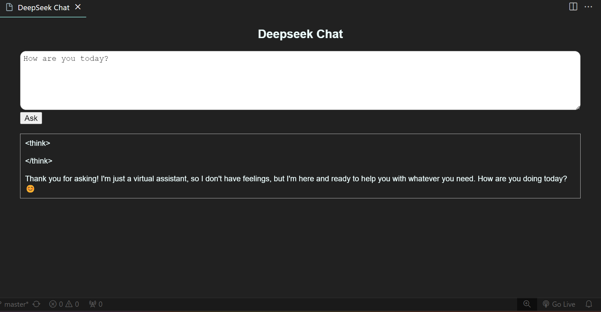

# DeepSeek Chat VSCode Extension

This repository contains a barebones VSCode extension that can be packaged and added to VSCode.
The extension communicates with a locally running Deepseek instance.

## Pre-requisites

- Install ollama globally from their [website](https://ollama.com/).
- Download one of the Deepseek models that suits your computer. [Model list](https://ollama.com/library/deepseek-r1)
  _(`ollama run deepseek-r1:8b`)_
- Make sure that the correct version is set [here](./src/extension.ts#L19)!

_The current implementation was tested using the 8b version._

## Developer setup

### Install dependencies

```bash
npm i
```

The extension can be tested using the vscode extension preview, or e.g. running it with debugging (F5).

### The extension can be packaged using `vsce`.

#### Install:

```bash
npm install -g @vscode/vsce
```

#### Packaging:

```bash
vsce package
```

_Additional information can be found [here](https://code.visualstudio.com/api/working-with-extensions/publishing-extension#packaging-extensions)._

The created `<xyz>.vsix` can be added to VScode as an extension, either through its UI, or through terminal:

```bash
code --install-extension <xyz>.vsix
```

## Usage

- Press `ctrl + shift + P` and select `Run: Deepseek Chat`.
- Type in your prompt to the top text box.
- Press the `Ask` button.
- Wait for the response below. _(Note that response time can vary based on your computer's hardware)_

**_I do not take resposibility for any answer that is provided as that is entirely done by the model.
The response is provided by the extension as-is._**

## Screenshot


